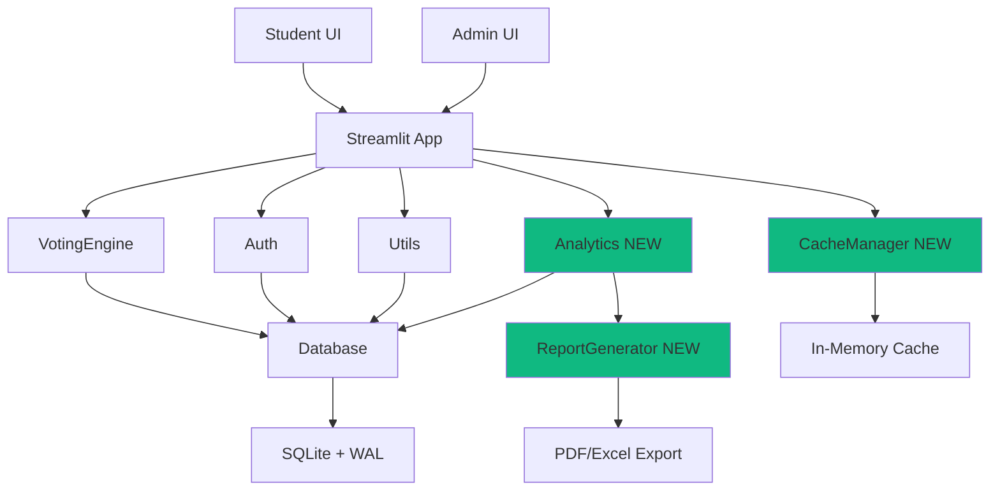

# Design Document: Election System Enhancements

## Overview

This design enhances the JB Academy Election Portal with student-facing results, advanced analytics, performance optimizations for 500-1000+ concurrent users, and comprehensive reporting capabilities. The enhancements maintain backward compatibility with the existing SQLite database, preserve the glassmorphic UI design, and follow established code patterns.

The system currently handles student/admin authentication, committee-based elections (School & House), phase management (Setup → Live → Closed), vote submission with verification, and basic results display. This enhancement adds student results access, detailed analytics dashboards, nomination previews, vote progress persistence, database optimizations, caching strategies, and enhanced multi-dimensional reports.

## Architecture



## Main Workflow: Student Results Access

```mermaid
sequenceDiagram
    participant S as Student
    participant A as App
    participant V as VotingEngine
    participant C as CacheManager
    participant D as Database
    
    S->>A: Login after voting
    A->>V: Check election phase
    V->>D: Query election_phase
    D-->>V: "closed"
    V-->>A: Results available
    
    A->>C: Get cached results
    alt Cache hit
        C-->>A: Return cached data
    else Cache miss
        C->>V: Fetch results
        V->>D: Query results_all
        D-->>V: Results data
        V-->>C: Processed results
        C-->>A: Return + cache
    end
    
    A->>S: Display results with charts
